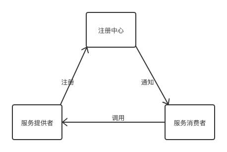

## 注册中心
 

## 接入前提

- 配置中心基于 zookeeper 来设计，需提前搭建好 zk 集群。

## Client 端接入方式（SpringBoot）

1. 引入 maven 依赖
    ```xml
        <dependency>
           <groupId>com.github.mjd507</groupId>
           <artifactId>register-center-client</artifactId>
           <version>1.0-SNAPSHOT</version>
        </dependency>
    ```
   
2. 配置zk连接，提供服务和消费服务的信息
    ```yaml
    register-center:
      connect-string: localhost:2181
      service-name: ${spring.application.name}
      discovery-service-name: ${spring.application.name}
    ```

3. 项目启动自动向注册中心注册此服务

4. 获取所以服务提供者
     ```java
        ServiceDiscovery.getAllServices();
    ```
